# Awesome-Cloud-Key-Management-Service-KMS 🔐 🗝️

  

  
  
  
  
  
  

---

## 🌟 Top Cloud Key Management Service (KMS) Ecosystem

**Curated List of Commercial KMS Platforms & Open-Source Secrets Management Tools** ⚡  
*Focused on Envelope Encryption, BYOK/HYOK, Dynamic Secrets, PKCS#11 Integration & Self-Hosted Vaults* 🛡️

**Last updated: October 2026** 📅

---

### 📌 Overview & SEO Summary 🚀

Welcome to the ultimate curated directory of **cloud key management services (KMS)**, **open-source secrets management platforms**, **hardware security modules (HSM)**, and **cryptographic key lifecycle frameworks**. Whether you are evaluating enterprise-grade commercial platforms (such as *AWS KMS*, *Azure Key Vault*, and *HashiCorp Vault*), or self-hostable open-source alternatives (like *HashiCorp Vault*, *Infisical*, *OpenBao*, *SOPS*, and *Bitwarden Directory Connector*), this list covers category leaders, external key stores, and privacy-respecting cryptographic infrastructure.

---

## 📑 Table of Contents 📜

- [🏢 SaaS & Commercial Platforms](#-saas--commercial-platforms)
- [🔓 Open-Source GitHub Projects](#-open-source-github-projects)
- [🛠️ How to Contribute](#%EF%B8%8F-how-to-contribute)
- [🤝 Support & Sponsorship](#-support--sponsorship)
- [📈 Star History](#-star-history)
- [⚠️ Disclaimer](#%EF%B8%8F-disclaimer)

---

## 🏢 SaaS / Commercial Platforms

> **Market Analysis & Fragmentation:** The global Cloud Key Management Service (KMS) and Secrets Management market is estimated at **~$3.2 Billion (2026)** and projected to reach **~$7.5 Billion by 2030** (CAGR ~18.5%). The sector is **moderately fragmented**: hyper-scaler cloud providers (AWS, Microsoft Azure, Google Cloud) dominate native workloads with strong lock-in, while independent multi-cloud platforms (HashiCorp Vault, CyberArk, Fortanix, Akeyless) capture complex multi-cloud and hybrid enterprise key management requirements.

The cloud KMS market spans **native cloud provider key services** (AWS KMS, Azure Key Vault, GCP Cloud KMS) that provide **deep integration with their respective ecosystems**, and **specialized third-party platforms** (HashiCorp Vault, Akeyless, Fortanix) that offer **multi-cloud key management and advanced secrets engines**. Pricing models vary significantly: **AWS KMS** charges **$1.00 per key per month** plus **$0.03 per 10,000 requests**. **Azure Key Vault** has **no separate storage fee for software keys**, charging **$0.03 per 10,000 operations**, with **HSM-protected keys at $1–$5 per key per month**. **GCP Cloud KMS** charges **$0.06 per key-version per month** for software keys and **$1.00 per key-version** for HSM-backed keys, with **$0.03 per 10,000 operations**.

| SaaS / Commercial Platform | Company / Owner | Valuation / Market Cap | Standard Edition Starting Price | Free Tier / Free Trial Limits | Description |
| :--- | :--- | :--- | :--- | :--- | :--- |
| **[Azure Key Vault](https://azure.microsoft.com/en-us/products/key-vault/)** 🔷 | Microsoft | ~$3.90 Trillion | **$0.03/10,000 ops** (software); **$1–$5/key/month** (HSM) | **10,000 operations/month free** | **Azure-native key management** — **Keys, secrets, and certificates in one service**. **Managed HSM** tier for FIPS 140-2 Level 3. **Deep Entra ID integration**. Soft-delete and purge protection for key deletion. 🔑 |
| **[AWS Key Management Service](https://aws.amazon.com/kms/)** ☁️ | Amazon | ~$2.00 Trillion | **$1.00/key/month** + **$0.03/10,000 requests** | **20,000 requests/month free** | **AWS-native KMS** — **Envelope encryption** for virtually every AWS resource. **Multi-region keys** for disaster recovery. **External Key Store (XKS)** for HYOK sovereignty. **CloudHSM** option for FIPS 140-2 Level 3. Annual automatic rotation for symmetric keys. 🔒 |
| **[Google Cloud KMS](https://cloud.google.com/kms)** 🌐 | Google (Alphabet) | ~$2.00 Trillion | **$0.06/key-version/month** (software); **$1.00/key-version/month** (HSM) + **$0.03/10,000 ops** | **$300 free credits (90-day trial)** for new accounts | **GCP-native KMS** — **Automatic key rotation** with versioned keys. **Cloud EKM** for external key management (keys reside outside Google). **Global keys** for multi-region workloads. **CMEK** across GCP services. 🌐 |
| **[CyberArk Conjur](https://www.conjur.org/)** 🏢 | CyberArk | ~$8.00 Billion | **~$400/app/year** (Enterprise Conjur) | **Conjur Open Source (OSS) free forever** | **Enterprise secrets management** — **Ties app secrets to CyberArk vault and policy**. **Strong for non-human identities and service accounts**. **Natural extension for organizations already invested in CyberArk PAM**. **Heavier to operate** than developer-first alternatives. 🏛️ |
| **[HashiCorp Vault](https://www.vaultproject.io/)** 🔐 | HashiCorp (IBM) | ~$5.00 Billion | **$1.58/hour** (~$1,150/mo HCP Vault Dedicated) | **Vault Community Edition free forever** | **Identity-based secrets management** — **Dynamic secrets** for AWS, databases, and SSH. **PKI engine** for certificate authority. **Encryption as a service**. **The reference implementation** for secrets management depth and flexibility. 🗝️ |
| **[Thales CipherTrust](https://cpl.thalesgroup.com/)** 🏛️ | Thales Group | ~$3.00 Billion | **~$250/month** (CipherTrust Cloud Data Protection SaaS) | **30-day free trial** on CipherTrust Data Security Platform Cloud | **Enterprise key and secrets management** — **KMIP 1.1+ support**. **FIPS 140-3 Level 3 via Luna HSM**. **CipherTrust Secrets Management powered by Akeyless Vault**. **Available as physical appliance, virtual appliance, or CDSPaaS**. ⚙️ |
| **[Fortanix DSM](https://www.fortanix.com/)** 🛡️ | Fortanix | ~$459 Million | **~$500/month** (Data Security Manager SaaS starting tier) | **30-day free trial** (no credit card required) | **Data Security Manager** — **Intel SGX-based runtime encryption**. **KMIP 1.4 support**. **Native multi-tenancy and BYOK**. **Strong vCloud Director integration**. **On-prem or SaaS deployment**. 🛡️ |
| **[Doppler](https://www.doppler.com/)** 💨 | Doppler | ~$153 Million | **$21/user/month** (Team Plan) | **Free forever for up to 3 users** (10 projects, 4 environments) | **Developer-first secrets management** — **`doppler run` injects secrets into any process**. **Environment sync** across local, staging, and production. **Broad platform integrations** (AWS, Azure, GCP, Kubernetes, Vercel, GitHub Actions). **Fastest adoption path** for product teams. ⚡ |
| **[Akeyless](https://www.akeyless.io/)** 🎯 | Akeyless | ~$79 Million | **~$250/month** (Team SaaS starting tier) | **Free forever for up to 5 clients**, 500 static secrets, 5 dynamic secrets | **SaaS and hybrid secrets management** — **KMIP support** for enterprise key management. **Dynamic secrets** and **just-in-time credentials**. **Gateway for private networks**. **Targets security and platform teams** needing broader coverage without self-hosting Vault. 🎯 |
| **[Infisical](https://infisical.com/)** 🌿 | Infisical | ~$50 Million | **$18/user/month** (Pro Plan) | **Free forever for up to 5 identities** (3 projects, 3 environments) | **Open-source secrets platform** — **Self-hostable** or cloud. **Modern UI** with Kubernetes operator and CI integrations. **Secret scanning** for code leaks. **Growing PKI/SSH features**. **The leading open-source challenger** to Vault and cloud-native services. 🌿 |

---

## 🔓 Open-Source GitHub Projects

*Sorted by GitHub Stars Count (Descending)* 🌟

- **[HashiCorp Vault](https://github.com/hashicorp/vault)**   
  **Identity-based secrets and encryption management system**, BUSL-1.1 licensed (v1.15+; earlier MPL-2.0). **The reference implementation** for secrets management depth and flexibility. **Dynamic secrets** for AWS, Azure, GCP, databases, and SSH. **PKI secrets engine** for certificate authority. **Transit engine** for encryption as a service. **The most widely deployed enterprise secrets management platform** — but the license change to BUSL drove the OpenBao fork. 🔐

- **[Infisical](https://github.com/Infisical/infisical)**   
  **Open-source secrets management platform**, MIT licensed (core). **Self-hostable** with cloud option. **Clean dashboard** with per-environment secrets. **CLI injects values into local processes**. **Kubernetes operator** and **secret scanning**. **PKI/SSH features** growing. **The leading open-source, developer-friendly alternative** to Vault and cloud-native services. 🌿

- **[Bitwarden Directory Connector / Server](https://github.com/bitwarden/server)**   
  **Open-source identity and secrets management backend**, GPL-3.0 licensed. **Enterprise secrets manager and credential vault** for developer teams and infrastructure. **Integrates with Directory services (LDAP/Active Directory)**. **End-to-end encrypted zero-knowledge infrastructure**. 🛡️

- **[SOPS (Secrets OPerationS)](https://github.com/getsops/sops)**   
  **Editor of encrypted files supporting YAML, JSON, ENV, INI, and BINARY formats**, MPL-2.0 licensed. **Encrypts values but leaves keys in plaintext** — enabling Git-based workflows. **Integrates with AWS KMS, GCP KMS, Azure Key Vault, age, and PGP**. **Used by Kubernetes, Terraform, and Ansible workflows**. **The standard for GitOps-friendly secrets management** — ideal for small teams and CI/CD pipelines. 📝

- **[External Secrets Operator](https://github.com/external-secrets/external-secrets)**   
  **Kubernetes operator that integrates external secrets management systems**, Apache-2.0 licensed. **Syncs secrets from AWS Secrets Manager, GCP Secret Manager, Azure Key Vault, HashiCorp Vault, and more** into Kubernetes. **The standard bridge** between cloud KMS providers and Kubernetes workloads. ☸️

- **[OpenBao](https://github.com/openbao/openbao)**   
  **Open-source, community-driven fork of Vault managed by the Linux Foundation's OpenSSF**, MPL-2.0 licensed. **95% vitality score** on the EU OSS Catalogue. **Secure secret storage** with encryption at rest. **Dynamic secrets** generated on-demand for AWS, SQL databases, and more with automatic revocation after lease expiry. **Data encryption** without storage. **The community-governed successor to HashiCorp Vault** after the BUSL license change. 🏛️

- **[Sealed Secrets](https://github.com/bitnami-labs/sealed-secrets)**   
  **Kubernetes-native encrypted secrets for GitOps**, Apache-2.0 licensed. **Asymmetric encryption** allows storing "SealedSecret" files safely in public Git repositories. **Only the controller running in the target K8s cluster can decrypt** the secret into a standard Kubernetes Secret object. 🔒

- **[age](https://github.com/FiloSottile/age)**   
  **Modern, simple, and secure file encryption tool**, BSD-3-Clause licensed. **Features small explicit keys, no configurable options, and UNIX-style composability**. **Designed as a modern replacement for gpg file encryption**, supporting SSH key identities. 🔑

- **[Vaultwarden](https://github.com/dani-garcia/vaultwarden)**   
  **Unofficial Bitwarden compatible server in Rust**, AGPL-3.0 licensed. **Lightweight self-hosted backend** perfect for small deployments, containers, and resource-constrained environments. ⚡

- **[sinduk](https://github.com/imshakil/sinduk)**   
  **Local-first secrets manager and team vault system**, open-source. **Zero-knowledge architecture** — secrets encrypted at rest with **PBKDF2-HMAC-SHA256 and Fernet (AES-128-CBC + HMAC)**. **Team vaults with RBAC** (viewer, editor, admin). **Multi-target sync** via Dropbox, Google Drive, NAS, Git, or self-hosted server. 📦

- **[PyKMIP](https://github.com/OpenKMIP/PyKMIP)**   
  **Python implementation of the KMIP protocol**, Apache-2.0 licensed. **KMIP server and client** for key management interoperability. **Recently revived for Veeam integration** — a community effort to fix compatibility with modern backup software. **The reference open-source KMIP implementation** for testing and integration. 🔌

- **[Cavern](https://github.com/m-c-alves/cavern)**   
  **Command-line credential vault protected by GPG**, open-source. **AES-256-GCM encryption** with authenticated decryption. **GPG-protected master key** — no new password to remember. **TOTP/2FA code generation** from stored otpauth URIs. **Git sync** for multi-machine backup. 🗝️

- **[secrets-vault-tui](https://github.com/m-c-alves/secrets-vault-tui)**   
  **Central TUI app and registry for managing secrets across machines**, open-source. **One encrypted vault + one plaintext registry** describing where values go. **Push to remote env files over SSH, systemd services, and command-based targets**. 🔄

---

## 🛠️ How to Contribute 🤝

Contributions are welcome! Follow these steps to submit new KMS platforms or open-source secrets management software:

1. 🍴 **Fork** the repository.
2. 📝 **Add/edit** entries in `README.md` maintaining table/list structure and formatting.
3. 🔗 Include project title, official website/GitHub link, exact Stars Count, license, and brief description.
4. 🚀 Submit a **Pull Request** with a descriptive summary of your changes.

---

## 🤝 Support & Sponsorship 💖

If you find this cloud KMS repository useful, please consider supporting the project:

- ⭐ **Star** this repository to increase visibility!
- 🔀 **Fork** and share with fellow security engineers, DevOps practitioners, and open-source advocates.
- ☕ **Sponsor & Buy Me a Coffee**: Support ongoing open-source curation via the [GitHub Sponsor Dashboard](https://github.com/sponsors/ishandutta2007).

---

## 📈 Star History

---

## ⚠️ Disclaimer ℹ️

- This is a **community-curated** list — not exhaustive and not an endorsement. ℹ️
- **Cloud KMS pricing varies dramatically by provider**: For **50 symmetric keys and 100,000 operations/month**, AWS costs **$53/month**, Azure costs **$0.30/month**, and GCP costs **$3.30/month**. **Model your actual key and operation volume** — GCP's per-key-version pricing and Azure's tiered HSM-key fees change meaningfully at scale.
- **HYOK (Hold Your Own Key) adds cost and risk**: GCP charges **$3.00/key-version/month for EXTERNAL keys** — three times the HSM rate — because every operation requires a live network round trip. **Google explicitly warns that losing access to an external key can cause permanent, unrecoverable data loss**.
- **HashiCorp Vault's license changed to BUSL-1.1**, driving the **OpenBao fork under Linux Foundation governance** with MPL-2.0 license and 95% vitality score. **Review licensing implications** for your organization before standardizing.
- **Akeyless excludes KMIP from its free tier** — KMIP is Enterprise-only with a hybrid SaaS model requiring an on-premises gateway. **Fortanix and Thales both support KMIP 1.4 and 1.1+ respectively** with on-prem or SaaS deployment options.
- **Open-source solutions (OpenBao, SOPS, Infisical) are not turnkey** — they require **deployment, operational expertise, and ongoing maintenance**. **SOPS is ideal for small teams and GitOps** but lacks dynamic secrets and centralized policy. **Always test key rotation and recovery procedures** before production deployment. 🔐

---

  <b>Made with ❤️ for security engineers, DevOps practitioners, and open-source secrets management advocates.</b>

